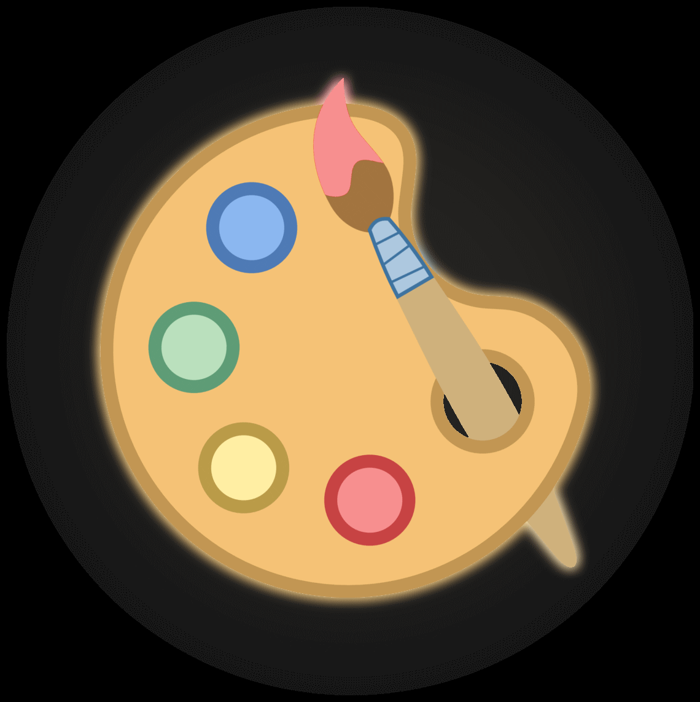
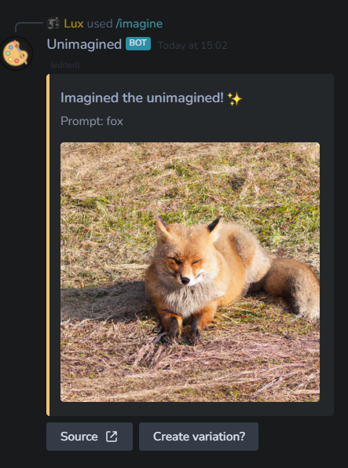

## Code Jam Bot



__config.json__
```json
{
    "token": "",
    "devGuild": "",
    "openai_key": "",,
    "createCommands": true/false
}
```

To get an api key, go to [this link](https://beta.openai.com/account/api-keys) and create a new key.

## Example 

